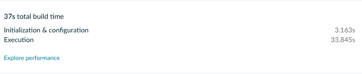
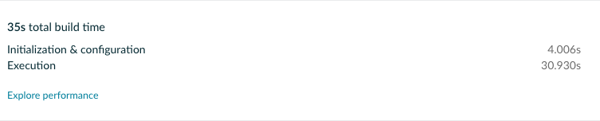
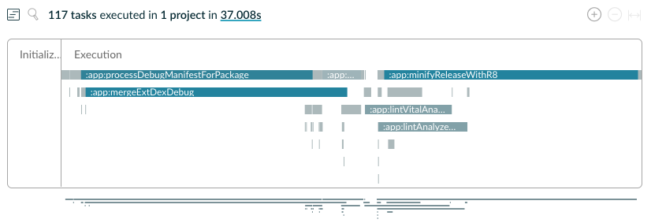

# ComposingBuildSample

It's about composing build with version catalogs sample.

|            | Without composing build                                    | Composing build                                    |
|------------|------------------------------------------------------------|----------------------------------------------------|
| Build Time |  |  |
| Time line  |   |   |

# Gradle scan report

- [Without composing build](https://scans.gradle.com/s/p2oj5jhjcimmk/timeline)
- [Composing build](https://scans.gradle.com/s/ek6hefozbzuoe/timeline)
